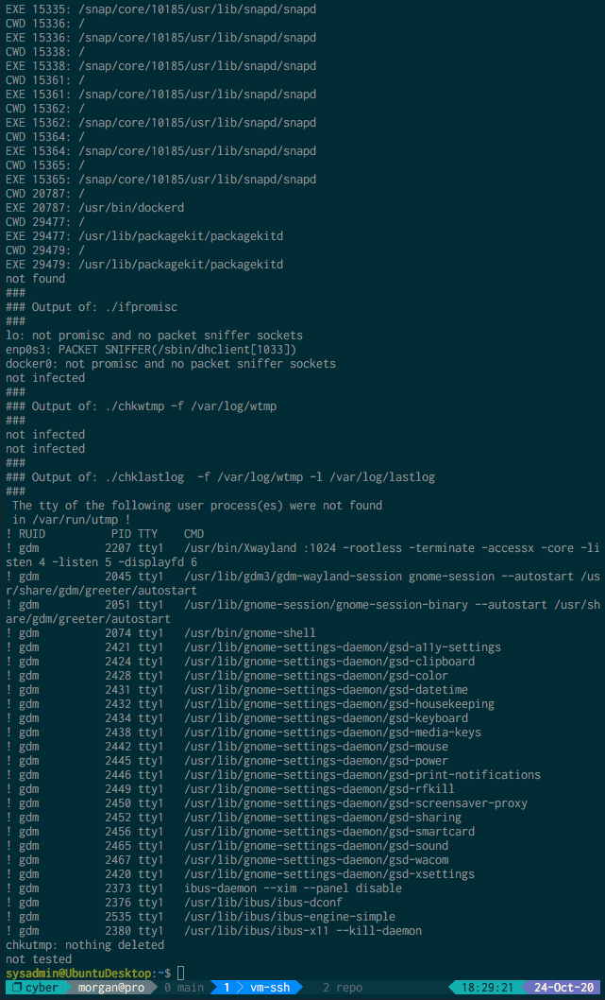

## Week 4 Homework Submission File: Linux Systems Administration

### Step 1: Ensure/Double Check Permissions on Sensitive Files

1. Permissions on `/etc/shadow` should allow only `root` read and write access.

    - Command to inspect permissions: `ls -lh /etc/shadow`

    - Command to set permissions (if needed): `sudo chmod 600 /etc/shadow`

2. Permissions on `/etc/gshadow` should allow only `root` read and write access.

    - Command to inspect permissions: `ls -lh /etc/gshadow`

    - Command to set permissions (if needed): `sudo chmod 600 /etc/gshadow`

3. Permissions on `/etc/group` should allow `root` read and write access, and allow everyone else read access only.

    - Command to inspect permissions: `ls -lh /etc/group`

    - Command to set permissions (if needed): `sudo chmod 644 /etc/group`

4. Permissions on `/etc/passwd` should allow `root` read and write access, and allow everyone else read access only.

    - Command to inspect permissions: `ls -lh /etc/passwd`

    - Command to set permissions (if needed): `sudo chmod 644 /etc/passwd`

### Step 2: Create User Accounts

1. Add user accounts for `sam`, `joe`, `amy`, `sara`, and `admin`.

    - Command to add each user account (include all five users):
    > **Note:** Each command will be followed by entering the desired user password
    > (twice), and several carriage returns to accept default values.

* `sudo adduser sam`
* `sudo adduser joe`
* `sudo adduser amy`
* `sudo adduser sara`
* `sudo adduser admin`

4. Ensure that only the `admin` has general sudo access.

    - Command to add `admin` to the `sudo` group: `sudo usermod -aG sudo admin`

### Step 3: Create User Group and Collaborative Folder

1. Add an `engineers` group to the system.

    - Command to add group: `sudo addgroup engineers`

2. Add users `sam`, `joe`, `amy`, and `sara` to the managed group.

    - Command to add users to `engineers` group (include all four users):
* `sudo usermod -aG engineers sam`
* `sudo usermod -aG engineers joe`
* `sudo usermod -aG engineers amy`
* `sudo usermod -aG engineers sara`
OR
* `for user in sam joe amy sara; do sudo usermod -aG engineers $user; done`

3. Create a shared folder for this group at `/home/engineers`.

    - Command to create the shared folder: `sudo mkdir -p /home/engineers`

4. Change ownership on the new engineers' shared folder to the `engineers` group.

    - Command to change ownership of engineer's shared folder to engineer group:
`sudo chown -R :engineers /home/engineers`
    > **Note:** This command only changes the group ownership of the folder. The
    > user owner is still `root`. Theoretically, we could change the owner to
    > somebody like `sysadmin`, but neither of those users are members of the
    > `engineers` group, so we're probably better off going with `root` instead.

### Step 4: Lynis Auditing

1. Command to install Lynis: `sudo apt install lynis`

2. Command to see documentation and instructions: `man lynis`

3. Command to run an audit: `sudo lynis audit system`

**Note:** I instead ran `sudo lynis audit system | tee ~/lynis-output.txt` so
I could take a screenshot of the output in addition to uploading the
redirected output.

4. Provide a report from the Lynis output on what can be done to harden the system.

    - Screenshot of report output:

[Lynis captured output](./lynis-output.txt)

### Bonus
1. Command to install chkrootkit: `sudo apt install chkrootkit`

2. Command to see documentation and instructions: `man chkrootkit`

3. Command to run expert mode: `sudo chkrootkit -x`

4. Provide a report from the chrootkit output on what can be done to harden the system.
    - Screenshot of end of sample output:

---
© 2020 Trilogy Education Services, a 2U, Inc. brand. All Rights Reserved.
