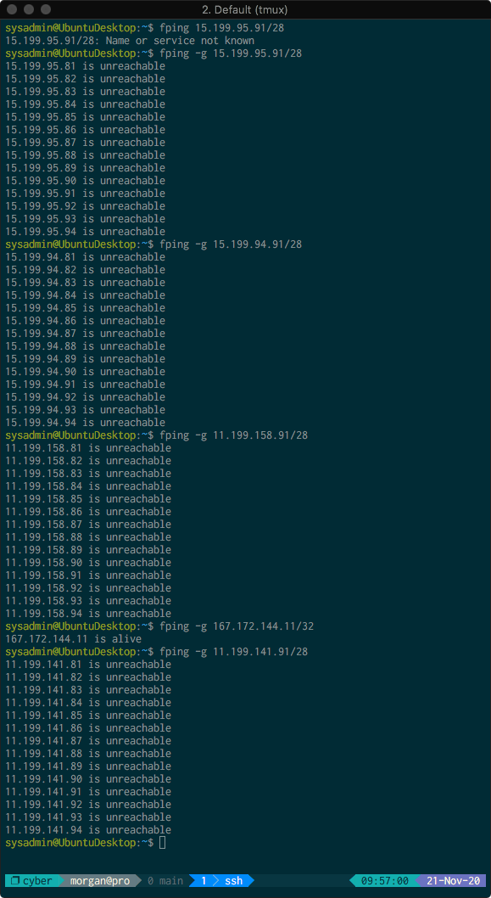
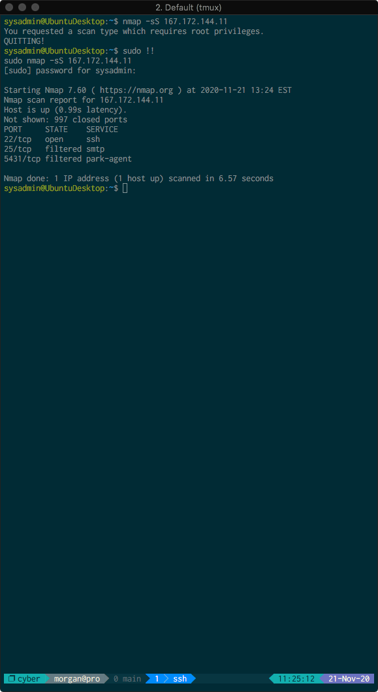
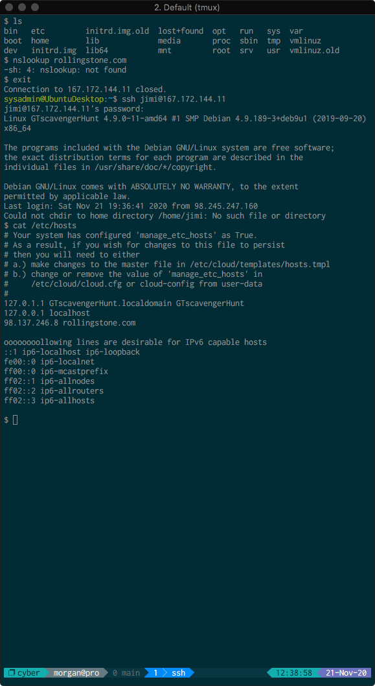
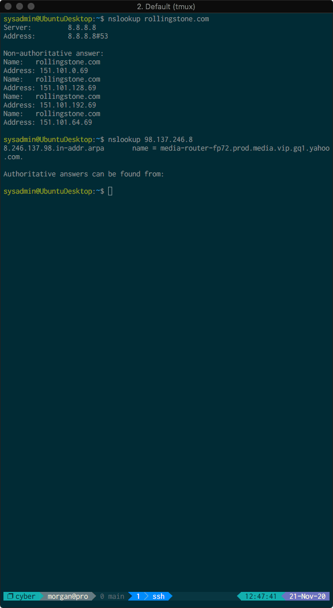

# Homework 08 - J. Morgan Lieberthal

### Phase 1

* Determined IP ranges to scan were as follows:
  * `15.199.95.91/28`
  * `15.199.94.91/28`
  * `11.199.158.91/28`
  * `167.172.144.11/32`
  * `11.199.141.91/28`

* `fping` commands used to scan the above IP ranges:
  * `fping -g 15.199.95.91/28`
  * `fping -g 15.199.94.91/28`
  * `fping -g 11.199.158.91/28`
  * `fping -g 167.172.144.11/32`
  * `fping -g 11.199.141.91/28`

Results of the `fping` commands:


Of all the servers pinged, only `167.172.144.11` is alive and accepting
connections. OSI network layer (3) was used to find these results, as both IP
and ICMP operate at the network layer.

* Determined a potential vulnerability for IP `167.172.144.11`, since it is
  accepting connections.
  * Recommend restricting ICMP traffic for IP `167.172.144.11` so it doesn't
    respond to `ping` requests.


### Phase 2

`nmap` command:
`sudo nmap -sS 167.172.144.11`

997 ports were closed, while port 22 (`ssh`) was open, and port 25 (`smtp`) and
port 5431 (`park-agent`) were filtered. All of these findings use the OSI
transport layer (4), since they use the tcp protocol.

Results of the SYN scan:



* Determined a potential vulnerability for IP:port `167.172.144.11:22`. Since
  the server at `167.172.144.11` is accepting SSH connections, an attacker could
  potentially get SSH access to the server.
  * Recommend restricting SSH access on the server unless absolutely necessary.
    If it is ineed necessary, recommend restricting SSH access to key-only
    access for increased security.

### Phase 3

* Since `167.172.144.11` is open to SSH connections (on port 22), I tried
  `ssh jimi@167.172.144.11` with the password `hendrix`. Following this, I got
  shell access on the server.

* The `/etc/hosts` file on the server has an entry for `rollingstone.com`, and
  has it configured to go to `98.137.246.8`

* Result of `cat /etc/hosts`:



* Running `nslookup 98.137.246.8` yielded the following results:

```bash
8.246.137.98.in-addr.arpa       name = media-router-fp72.prod.media.vip.gq1.yahoo.com.
```

* Running `nslookup rollingstone.com` yielded the following results:
```bash
Name:   rollingstone.com
Address: 151.101.0.69
Name:   rollingstone.com
Address: 151.101.128.69
Name:   rollingstone.com
Address: 151.101.192.69
Name:   rollingstone.com
Address: 151.101.64.69
```

* Results of both `nslookup` commands:


* The actual IP address of `rollingstone.com` is one of the following (depending
  on the load balancer):
  * `151.101.0.69`
  * `151.101.128.69`
  * `151.101.192.69`
  * `151.101.64.69`

* Recommend somebody with `sudo` permissions delete the entry in `/etc/hosts`
  that redirects `rollingstone.com` to the incorrect IP address.

* All of these findings are found at OSI layer 7, since DNS is an
  __application__ layer protocol.

### Phase 4

* File that the hacker left is `/etc/packetcaptureinfo.txt`

* The file indicates the packet capture files are located at:
`https://drive.google.com/file/d/1ic-CFFGrbruloYrWaw3PvT71elTkh3eF/view?usp=sharing`

* Analysis of ARP packets in the packet capture file determined that two nodes
  are responding to the `192.168.47.200` IP address, located at the following
  MAC addresses:
  * `00:0c:29:0f:71:a3`
  * `00:0c:29:1d:b3:b1`

  * This is possibly the result of ARP poisoning, but there simply aren't enough
    packets to determine.

* Additionally, there is a suspicious HTTP POST request to `forms.yola.com`,
  from the dubiously named "Mr. Hacker", and containing the following message
  encoded in the form data:
  > Hi Got The Blues Corp!  This is a hacker that works at Rock Star Corp.  Rock
  > Star has left port 22, SSH open if you want to hack in.  For 1 Million
  > Dollars I will provide you the user and password!

* This should leave no doubt that there is a hacker working inside Rock Star
  Corp. The security team should take steps to apprehend and censure the
  hacker.

* While it is still unclear who the hacker is, he or she has the email address
  `Hacker@rockstarcorp.com` and their computer has the mac address
  `08:00:27:f8:42:a7`. Hopefully the hacker can be apprehended before any
  corporate secrets are stolen and any more damage is done.
