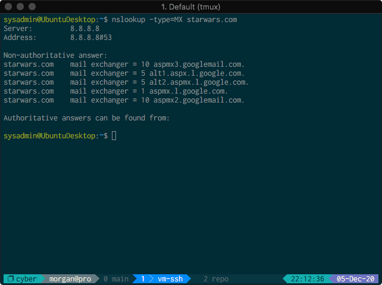
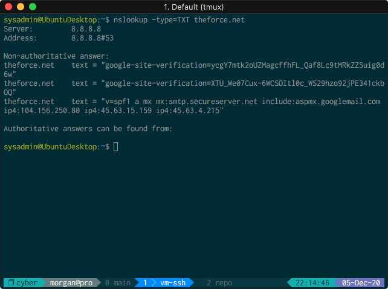
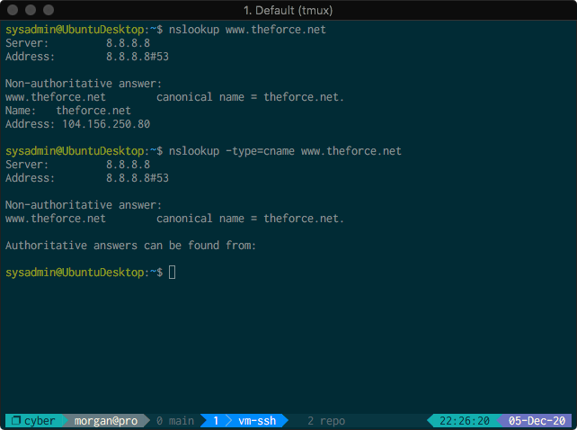
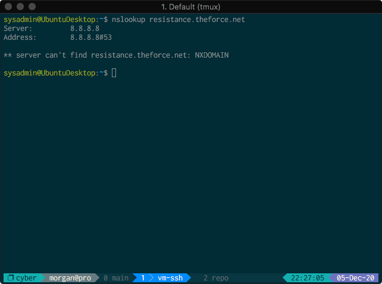
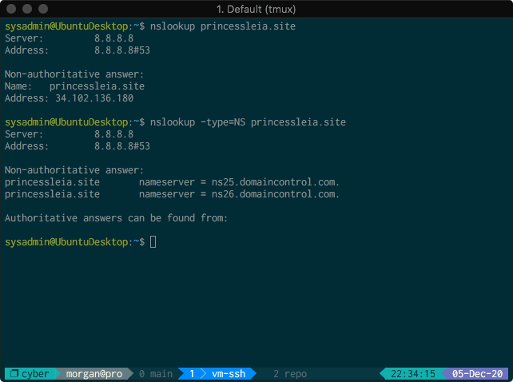
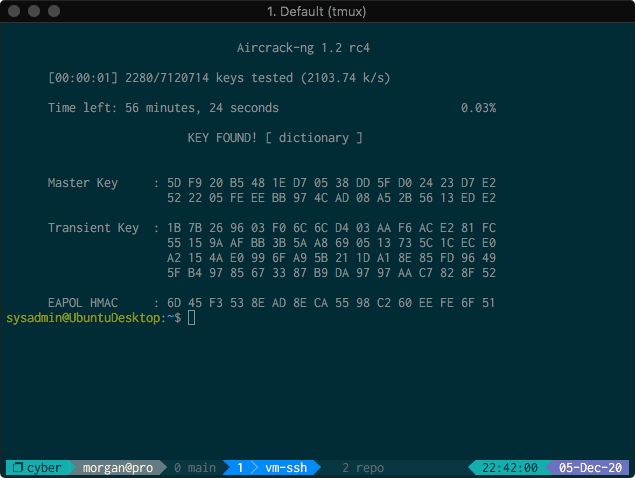
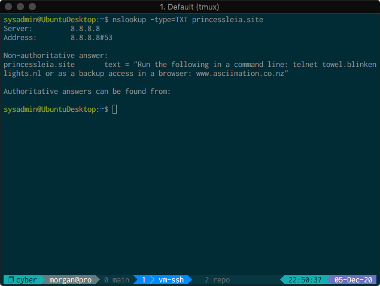
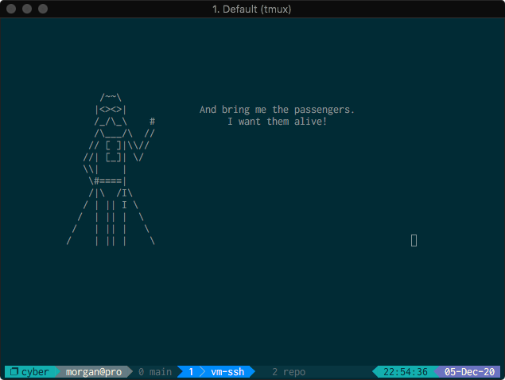

# JML Homework-09

### Mission 1

Check MX records for `starwars.com` using the following command:

```bash
nslookup -type=MX starwars.com
```

Results of the `nslookup` command:



The mail servers configured for `starwars.com` are as follows:

* `alt1.aspx.l.google.com`
* `aspmx2.googlemail.com`
* `aspmx3.googlemail.com`
* `aspmx.l.google.com`
* `alt2.aspmx.l.google.com`

The resistance is not receiving emails because neither the new primary mail
server (`asltx.l.google.com`) nor the secondary server (`asltx.2.google.com`)
are configured in the DNS record.

Recommend configuring the DNS records as follows to fix email issues for the
resistance:

```bash
starwars.com    mail exchanger = 1 asltx.l.google.com.
starwars.com    mail exchanger = 5 asltx.2.google.com.
```

### Mission 2

To determine the `SPF` record for `theforce.net`, run the following command:

```bash
nslookup -type=TXT theforce.net
```

Results of the `nslookup` command:



The text record containing the SPF record is as follows:

```bash
theforce.net    text = "v=spf1 a mx mx:smtp.secureserver.net include:aspmx.googlemail.com ip4:104.156.250.80 ip4:45.63.15.159 ip4:45.63.4.215"
```

The above SPF record indicates authorized emails coming from `theforce.net`
should only come from the following IP addresses:

* `104.156.250.80`
* `45.63.15.159`
* `45.63.4.215`

SPF records list all authorized hostnames and IP addresses that are permitted to
send email on behalf of a given domain.
Since the IP address supplied in the instructions (`45.23.176.21`) is not in the
SPF record, most spam filters will flag emails coming from `45.23.176.21` with
the sender `theforce.net` as spam.

A corrected SPF record for `theforce.net` should read as follows, when returned
from the above `nslookup` command:

```bash
theforce.net    text = "v=spf1 a mx mx:smtp.secureserver.net include:aspmx.googlemail.com ip4:45.23.176.21"
```

### Mission 3

To determine how a correct `CNAME` record should look using `nslookup`, run one
of the following commands (depending on if one wants the entire record, or only
the `CNAME` record):

```bash
nslookup www.theforce.net
nslookup -type=CNAME www.theforce.net
```

Results of the above `nslookup` command:



The relevant portion of the result of the command is:

```bash
www.theforce.net        canonical name = theforce.net.
```

To determine the current DNS records for `resistance.theforce.net`, run the
following command:

```bash
nslookup resistance.theforce.net
```

Results of the above `nslookup` command:



The subdomain `resistance.theforce.net` is not redirecting to `theforce.net`
because there is no DNS record specified for `resistance.theforce.net`. To
ensure `resistance.theforce.net` redirects to `theforce.net`, a proper DNS
`CNAME` record should read as follows when returned from the above `nslookup`
command:

```bash
resistance.theforce.net        canonical name = theforce.net.
```

### Mission 4

To confirm the DNS records for `princessleia.site`, run the following commands:

```bash
nslookup princessleia.site
nslookup -type=NS princessleia.site
```

The first command checks the IP address of the site, while the second command
checks what nameservers are being used to provide the information returned from
the first command.

Results of the above `nslookup` commands:



`princessleia.site` is currently using the following nameservers to provide DNS
information on the site:

* `ns25.domaincontrol.com`
* `ns26.domaincontrol.com`

The provided DNS server at `ns2.galaxybackup.com` is not in the above record.
A properly-configured DNS record would read as follows, when returned from the
`nslookup -type=NS princessleia.site`:

```bash
princessleia.site       nameserver = ns2.galaxybackup.com.
```

### Mission 5

The shortest path to go from Batuu to Jedha, while avoiding Planet N, is as
follows:

```
Batuu -> D -> C -> G -> O -> R -> Q -> T -> V -> Jedha
```

The route takes a total of 23 hops, and does not include Planet N.


### Mission 6

To determine the wireless key used to decrypt traffic for the
[Darkside.pcap](./Darkside.pcap) file, run the following command (assuming
`Darkside.pcap` is in the current working directory):

```bash
aircrack-ng Darkside.pcap -w /usr/share/wordlists/rockyou.txt
```

Running the above command yielded the following results:



Running `aircrack-ng` returned the password `dictionary`, which can be used to
decrypt the wireless traffic. Analysis of the `.pcap` file indicates the
wireless access point ("WAP") used by the Dark Side has the SSID `linksys`.

Further analysis of the decrypted `ARP` traffic yields the following results:

* `ARP` requests are originating from the IP address `172.16.0.101`, and come
  from an NIC with the mac address `00:13:ce:55:98:ef`.
* An `ARP` reply indicating which computer is using the IP address `172.16.0.1`
  indicates that IP address is being used by a machine with the mac address
  `00:0f:66:e3:e4:01`.

In summary, the following mac address / IP pairs can be found on the `linksys`
network used by the Dark Side:

* `00:13:ce:55:98:ef` => `172.16.0.101`
* `00:0f:66:e3:e4:01` => `172.16.0.1`

### Mission 7

To view the TXT DNS record for the record used in Mission
4 (`princessleia.site`), run the following command:

```bash
nslookup -type=TXT princessleia.site
```

Results of the above `nslookup` command:



The hidden message in the `TXT` record indicates we should run the following
command to receive our reward:

```bash
telnet towel.blinkenlights.nl
```

Running the above command connects to a telnet server, which plays an ASCII art
animation of _A New Hope_, as documented below.


