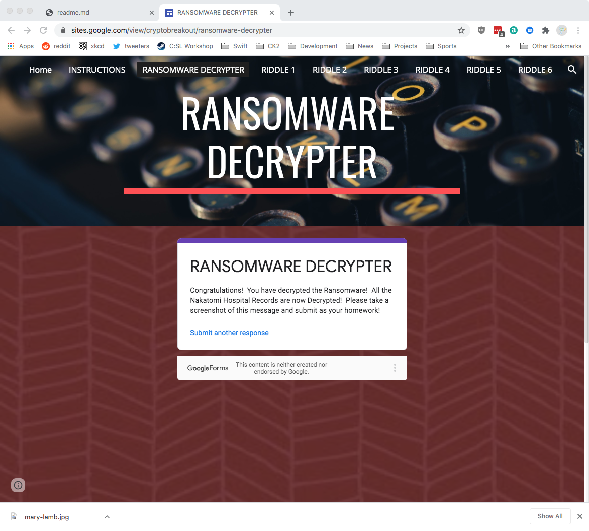

# Notes - Homework 13

#### Riddle 1

* Caesar cypher - rot8
* cyphertext => ozcjmz
* plaintext =>  gruber
* **KEY**: 6skd8s

#### Riddle 2

* Encoded Binary: 01000111 01100101 01101110 01101110 01100101 01110010 01101111
* Decoded Text: Gennero
* **KEY**: cy8snd2

#### Riddle 3

* Cipher Text: 4qMOIvwEGXzvkMvRE2bNbg==
* Key: 5284A3B154D99487D9D8D8508461A478C7BEB67081A64AD9A15147906E8E8564
* IV: 1907C5E255F7FC9A6B47B0E789847AED
* Decoded Text: takagi
* **KEY**: ud6s98n

#### Riddle 4

* Number of People: 6
* Number of Symmetric keys `(N * (N - 1))/2`: 15
* Number of Asymmetric keys `(N * 2)`: 12
* **KEY**: 7gsn3nd2

#### Riddle 5

* Hash: 3b75cdd826a16f5bba0076690f644dc7
* Use hashcat to decode
* Result: argyle
* **KEY**: ajy39d2

#### Riddle 6

* Use steghide
* Passphrase is `ABC`
* Extracted code is `mcclane`
* **KEY**: 7skahd6

#### Ransomware Decrypter

The ransomware has been decrypted, as evidenced by this screenshot:

