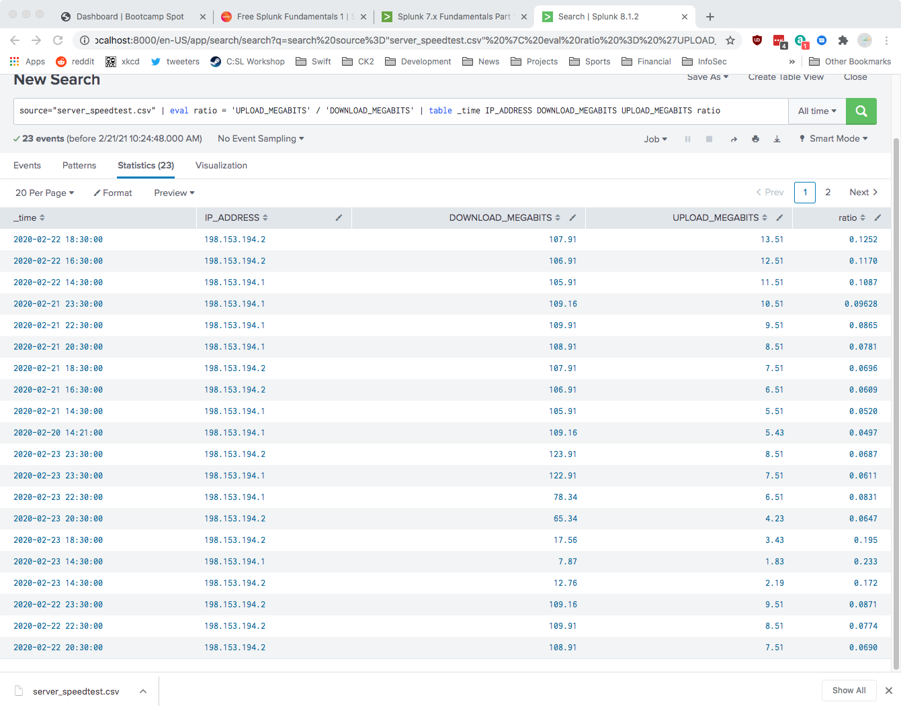
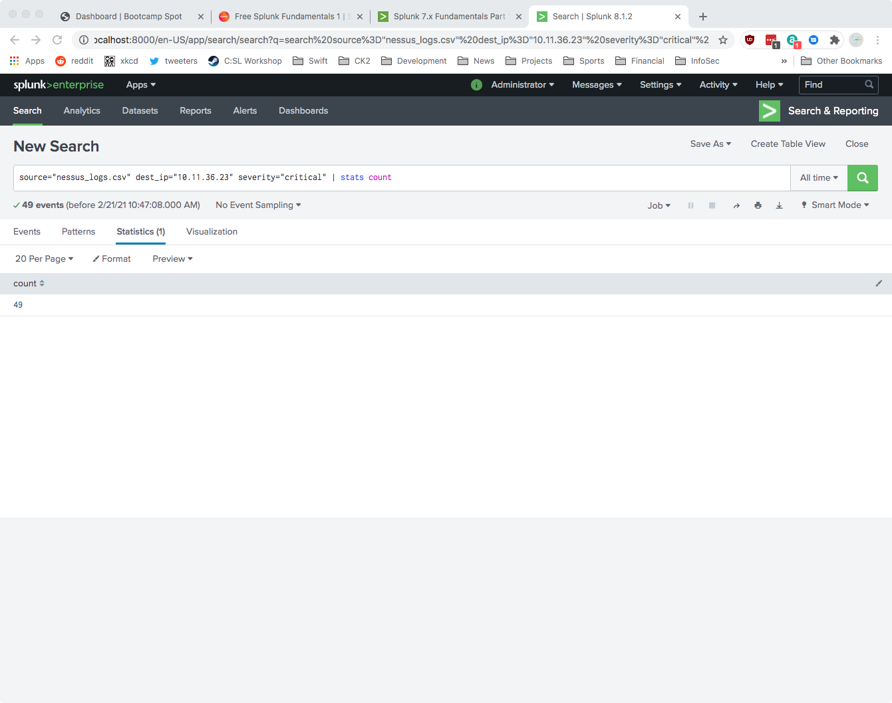
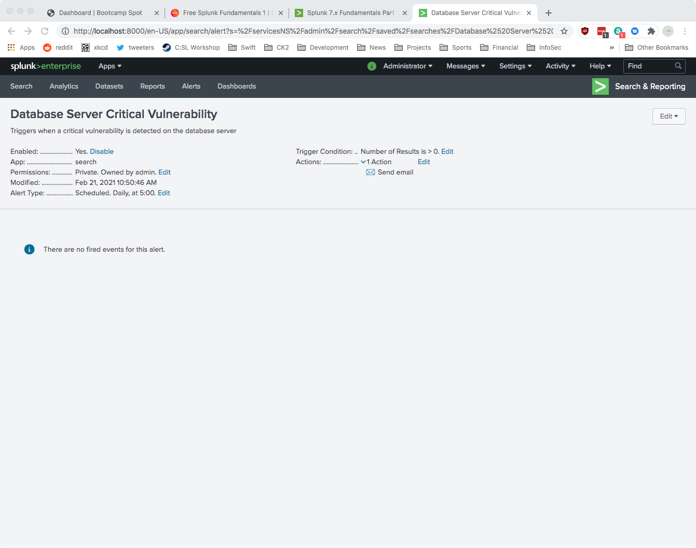
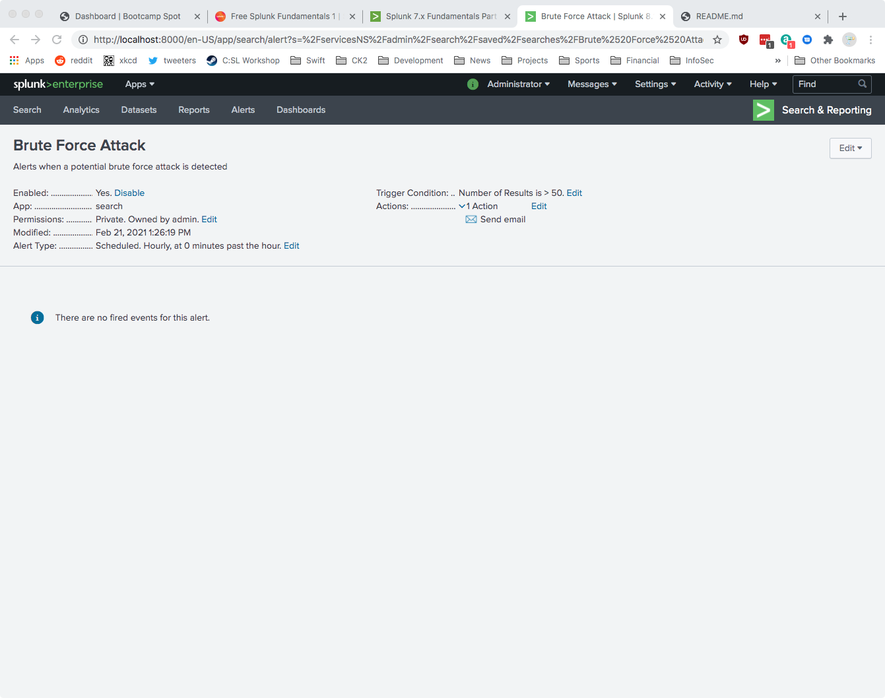

# Homework 18 - SEIMs

### Step 1

The created table is shown below:

Based on the above report, the attack occurred at approximately 14:30 on
February 23, 2020. Systems recovered and were operating normally by 23:00 on
February 23, 2020, representing a total recovery time of 8 hours and 30 minutes.

### Step 2

The created report is shown below:

Proof the alert has been created:

### Step 3

The attack occurred between 9:00 AM and 1:00 PM on February 21, 2020. Normal
activity with regard to failed login attempts seems to fluctuate between six (6)
and approximately 20 attempts per hour. During each of the hours of the attack,
the number of failed login attempts increased to 124, 101, 121, 95, and 123.
A baseline of normal failed login attempt activity might be 25 failed attempts
per hour, with a threshold of 50 attempts per hour triggering an alert.

Proof the alert has been created:

